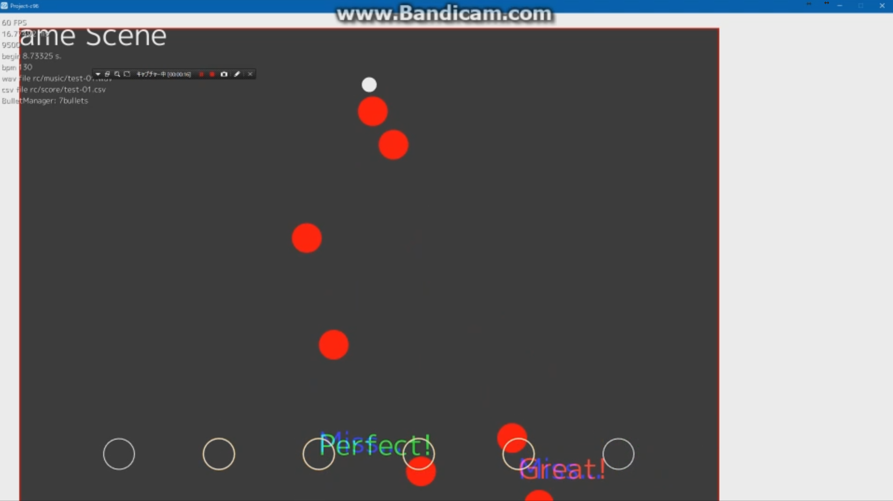

# コミックマーケット C96 作品ページ

この度は `関西大学Game Creation Circle C「GCCC」` の作品を手にとっていただきありがとうございます．  
当ページは`嶌岡 柊也 - Hiragi-GKUTH`の作品のページとなります．

各々のゲームは当ページ経由でDL/アップデート可能になる予定ですが，その際にパッケージ同梱のプロダクトコードが必要になります．

## 出る杭を打つゲーム

GCCC内の短期間ゲームジャムにて制作したゲームです．2005年前後のフラッシュゲームを意識して制作いたしました．
あの頃の思い出を感じつつプレイしてください．

### 操作方法
タイミングに合わせて左クリック

### 更新情報
いくつかのバグや放置したままのゴミが残っているので，今後アップデートを予定しております

|更新日|リンク|
|:-:|:-:|
|Coming soon...|Coming soon|

## 楽して単位ほしい！

こちらもゲームジャムで作成したゲームです．`1000兆円ほしい！`が流行った時代のゲームです．  

### 操作方法
* 左クリック: 単位を拾う  

単位が落ちていくので，できるだけ**ギリギリ**に取りましょう，**ギリギリ**の方が楽ですからね，スコアもたまります．
ただ落としてしまうと大幅な原点です．  
Twitterでスコア報告も出来るのでハッシュタグで検索しましょう！

### 更新情報
既知のバグが存在しないので，今の所未定です．更新あるかもしれない

|更新日|リンク|
|:-:|:-:|
|Coming soon...|Coming soon|

## Project-c96

完成しなかった不完全作品．申し訳ありません．
途中までは弾幕STGとして制作していたゲーム．途中で何故か音ゲーに変更．開発途中感あふれる画面をお楽しみください(?)
採用している2曲はすべてオリジナルで，今後増えます．
またユーザ自身で好きな楽曲を登録でき，譜面を作成する機能もつけています．

### 操作方法及びゲーム説明
* タイトル画面
    * Game Start以外は選択できません．
* セレクト画面
    * 左クリック: プレイ
    * 右クリック: 譜面作成
* ゲーム画面/譜面作成画面
    * S, D, F, J, K, Lキー: ノーツを叩く
    * 譜面作成の場合，押したタイミングが表示されていきます
    * 楽曲終了とともに譜面が保存されます．

### 更新情報
見たとおり全くの未完成のため，今後開発が進むごとに更新をしていきます．

|更新日|リンク|
|:-:|:-:|
|Coming soon...|Coming soon|

# ライセンス
 この 作品 は <a rel="license" href="http://creativecommons.org/licenses/by-nc-nd/4.0/">クリエイティブ・コモンズ 表示 - 非営利 - 改変禁止 4.0 国際 ライセンス</a>の下に提供されています。